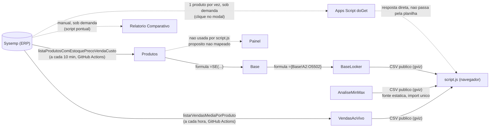

# Linhagem de Dados — Painel Bradisfer

> Documento de governança. Objetivo: qualquer pessoa (inclusive uma versão futura de mim) consegue olhar aqui e saber **de onde vem cada dado, quem é responsável por atualizá-lo, e qual a validade dele** — sem precisar reconstruir a investigação do zero, como aconteceu com o bug do código de barras em 25/08/2026 (a aba `Base` intermediária só foi descoberta durante aquela depuração).
>
> Última revisão: 25/08/2026. Atualizar este arquivo sempre que uma fonte de dados, aba ou script mudar de lugar/comportamento — é uma falha de governança deixar esse documento ficar desatualizado silenciosamente, o mesmo problema que ele existe pra evitar.

## Visão geral do fluxo

## Fontes primárias (Sysemp)

| Endpoint | Consumido por | Frequência | O que traz |
|---|---|---|---|
| `listaProdutosComEstoquePrecoVendaCusto` | `automacao-vendas/atualizar-estoque.js` (GitHub Actions) | A cada 10 min (5h–23h59 e 0h–2h Brasília) | Catálogo inteiro: estoque, mín/máx, custo, preço de venda, código de barras |
| `listarVendasMediaPorProduto` (sem `cod_barra`) | `automacao-vendas/atualizar-vendas.js` (GitHub Actions) | A cada hora (mesma janela) | Catálogo inteiro: média mensal e total vendido (12 meses), por produto |
| `listarVendasMediaPorProduto`/compras (1 produto) | Apps Script `doGet` (projeto "Estoque") | Sob demanda, a cada clique no modal de produto | Últimas compras e venda AO VIVO de 1 produto só |
| (endpoint de venda por vendedor/meta) | — não implementado | — | Pedido enviado à Sysemp, resposta pendente — ver `CONTEXTO.md` |

**Autenticação**: header `Token` (não `Authorization: Bearer`), enviado em toda chamada. Token guardado como secret `SYSEMP_TOKEN` no GitHub (para as automações) e como propriedade do script no Apps Script (para o `doGet`). Sem endpoint de login separado — é um valor estático fornecido pela Sysemp.

## Planilha Google (`Bradisfer_Painel_Estoque_v2`, ID `1KThPNCmslfoK3zpzxhK6Jh8taj5tKEiNkmsbHTWnV-A`)

| Aba | Como é preenchida | Dono / atualizador | Validade | Consumida por |
|---|---|---|---|---|
| **Produtos** | Escrita direta (`values.clear` + `values.update`, RAW) por `atualizar-estoque.js` | Automação (GitHub Actions) | Sempre fresca (~10 min) | Aba `Base` (fórmula) |
| **Base** | Fórmula `=SE(Produtos!Bxxxx="";"";Produtos!Bxxxx)` célula a célula, referenciando `Produtos` | Ninguém edita manualmente — nota na própria aba: *"BASE — calculada automaticamente a partir da aba Produtos. Não editar manualmente."* | Reflete `Produtos` quase em tempo real (recálculo de fórmula do Sheets) | Aba `BaseLooker` (fórmula) |
| **BaseLooker** | Fórmula `={Base!A2:O5502}` (array, espelha `Base` inteira) | Idem — não editar manualmente | Idem `Base` | **`script.js`** (fonte principal do painel, via CSV público) |
| **AnaliseMinMax** | Import manual único (Excel → Sheets), feito uma vez | Ninguém — **congelada desde a importação original** (~meados de agosto/2026) | ⚠️ **Estática, não atualiza sozinha.** Só fallback pra produtos ainda não cobertos por `VendasAoVivo` | `script.js` (fallback + Curva ABC/Nível de Atendimento informativos) |
| **VendasAoVivo** | Escrita direta por `atualizar-vendas.js` (upsert por código de barras) | Automação (GitHub Actions) | Fresca (~1h) | `script.js` (fonte principal de sugestão de compra) |
| **Relatorio Comparativo** | Escrita direta por `automacao-vendas/relatorio-comparativo.js` | Manual — só quando alguém dispara o workflow `Relatorio Comparativo (Julho x Agosto)` | Só reflete o momento em que foi gerado, não atualiza sozinha | Ninguém automaticamente — leitura manual na planilha |
| **Painel** | ⚠️ **Não mapeado.** Existe na planilha (visível na lista de abas), mas nenhum script deste repositório (nem `script.js`, nem as automações) lê ou escreve nela | Desconhecido | Desconhecido | Desconhecido — **investigar antes de assumir que está em uso ou que pode ser removida** |

### Nota sobre a coluna "Código Barras"

Grava com uma aspa simples como parte literal do conteúdo (`'0074468051034`), não como dica de formatação — é a única forma que resistiu a reformatação automática do Google Sheets (ver `CONTEXTO.md`, investigação de 25/08/2026). `script.js` remove essa aspa ao ler (`limparCodigoBarras()`). Qualquer novo lugar que grave ou leia essa coluna precisa seguir o mesmo padrão, senão o cruzamento entre `Produtos`/`VendasAoVivo` quebra silenciosamente.

## Dados embutidos no código (fora da planilha)

| O quê | Onde | Origem | Validade |
|---|---|---|---|
| `TABELA_PRECOS` | `script.js` (constante grande, embutida no código-fonte) | Export manual da Sysemp ("manutenção da tabela de preços"), colado no código em 18/08/2026 | ⚠️ **Foto estática do dia da exportação.** Preço/margem mudam com reajuste e isso não atualiza sozinho. Ideal: migrar pra uma aba própria da planilha (mesmo padrão de `VendasAoVivo`), ainda não feito |

## Camadas de acesso e proteção

| Camada | Protegida? | Como |
|---|---|---|
| Tela do painel (GitHub Pages) | ✅ Sim | Login Google restrito por e-mail (`EMAILS_PERMITIDOS` em `script.js`), implementado 25/08/2026 — "Nível A" |
| CSV público das abas `BaseLooker`/`AnaliseMinMax`/`VendasAoVivo` | ❌ Não | Continuam com compartilhamento "qualquer pessoa com o link" — quem souber a URL do `gviz` acessa direto, sem passar pelo login. Corrigir isso exigiria "Nível B" (mover a hospedagem do painel pro Apps Script/backend próprio e servir os dados só depois de validar login) — não implementado |
| Secrets (`SYSEMP_TOKEN`, `GOOGLE_SERVICE_ACCOUNT_KEY`) | ✅ Sim | Guardados como GitHub Actions secrets; nunca aparecem em código versionado |

## Donos por área (pra saber a quem perguntar)

| Área | Responsável hoje |
|---|---|
| Token/acesso à API Sysemp | Usuário (contato direto com suporte Sysemp via WhatsApp) |
| Planilha Google (estrutura das abas, fórmulas) | Usuário — criada originalmente a partir de um `.xlsx` importado, mantida à mão nas partes não automatizadas (`Base`, `BaseLooker`, `AnaliseMinMax`) |
| Automações (GitHub Actions, `automacao-vendas/*.js`) | Código no repositório, sem dono humano designado além de quem tem acesso ao repo |
| Lista de e-mails autorizados no painel | Usuário (`EMAILS_PERMITIDOS` em `script.js`) |

## Lacunas conhecidas (não resolvidas ainda)

1. **Aba "Painel" não mapeada** — precisa investigar o que é antes de mexer em qualquer coisa perto dela.
2. **`TABELA_PRECOS` congelada** desde 18/08/2026, embutida no código em vez de numa aba viva.
3. **`AnaliseMinMax` congelada** desde a importação original — só fallback, mas ainda influencia Curva ABC/Nível de Atendimento exibidos.
4. **CSV público sem proteção real** — só a tela do painel tem login, os dados brutos continuam acessíveis por quem souber a URL.
5. **Código morto no Apps Script** — as funções antigas `atualizarEstoque`/`atualizarVendasAoVivo` continuam fisicamente no arquivo do projeto "Estoque", mesmo com os gatilhos removidos (confirmado 25/08/2026). Não executam mais, mas podem confundir quem abrir o projeto sem saber disso.
